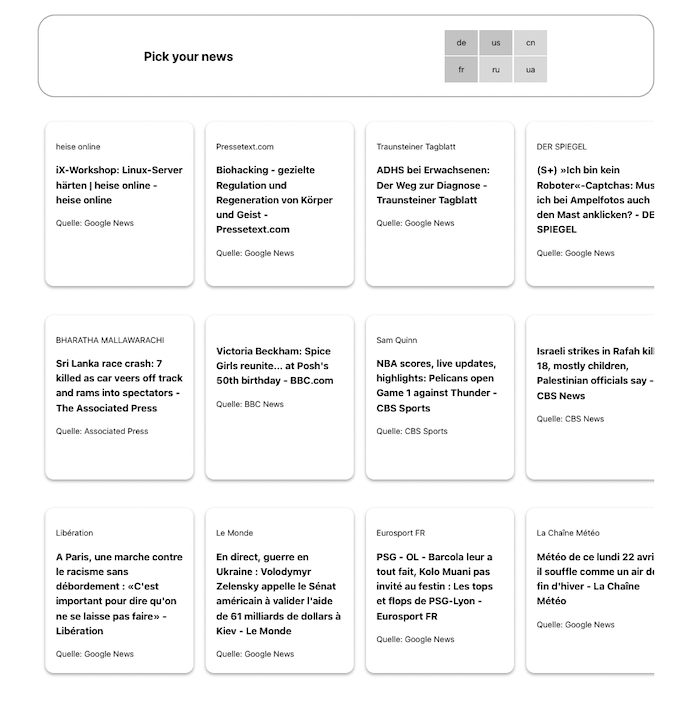

# Pick your news

This little tool fetches news from different sources and curates an overview of the ones the user wants to see. <br>
Whilst the number of sources preferably increases continuously, the way the content is presented will change with every iteration. We'll see how things develop. 
<br>
<br>

<br>
<br>

### Tech-Stack
- React, TS, Vite.js
- local-storage
<br>
<br>

### Current workflow

For demonstation purposes the "backend" is hardcoded and only just consists of an array of slightly [*curated objects*](https://github.com/j-eick/my-news/blob/main/src/utils/headlines.tsx) that each include a link to the source. <br>
I call it "curated", because every array of headlines is potentially rendered conditionally and in order to render conditionally next to more features, properties like `active: boolean`, `tag: ["finance", "climate", etc.]` are needed. <br>
<br>
Process of conditionally rendering: <br>
1. Filtering for headline arrays that are set to `active: true`.
```tsx
export default function useFetchAllHL(allHeadlines: UncuratedHLArrayProps[]) {
  const [curatedHLs, setCuratedHLs] = useState<CuratedHeadlineProps[][]>([]);

  const activeHeadlines: string[] = allHeadlines
      .filter((item: UncuratedHLArrayProps) => item.active == true)
      .map(
        (item: UncuratedHLArrayProps) => item.url + import.meta.env.VITE_apiKEY
      );    
```
2. Pull data from local storage OR fetch from api
```tsx
//---check local-storage
const dataFromStorage = localStorage.getItem("localData");

//---IF localStorage has NO DATA   OR   userHL differs from local-storage-HLs
if (dataFromStorage == null || updateDisplayedHLs(allHeadlines)) {
  //---fetch from api
  fetchData(activeHeadlines);
  } else {
    try {
      const dataFromLS = localStorage.getItem("localData");
        
      if (dataFromLS !== null) {
        const data = JSON.parse(dataFromLS);
        setCuratedHLs(data);
      }
    } catch (err) {
      console.error("Fetching from localstorage went wrong: " + err);
    }
  }
```

3. Fetching for now via for-loop
```tsx
    async function fetchData(activeHeadlines: string[]) {

      const allArticlesByCountries: CuratedHeadlineProps[][] = [];
      for (const [i, headline] of activeHeadlines.entries()) {
        try {
          const res = await fetch(headline);
          const data = await res.json();
          const articles = await data.articles;          

          //---curate new headline objects
          const curatedArticlesArray: CuratedHeadlineProps[] = [];
          for (const article of articles) {
            const curatedHL: CuratedHeadlineProps = {
 
              country: allHeadlines[i].country,
              handle: allHeadlines[i].handle,
              active: allHeadlines[i].active,
              ...article,
            };
            
            curatedArticlesArray.push(curatedHL);
          }
          allArticlesByCountries.push(curatedArticlesArray);

        } catch (err) {
          console.error("Mööp: " + err);
        }
      }
      
      setCuratedHLs(allArticlesByCountries);
      localStorage.setItem("localData", JSON.stringify(allArticlesByCountries));
    }
```